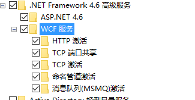
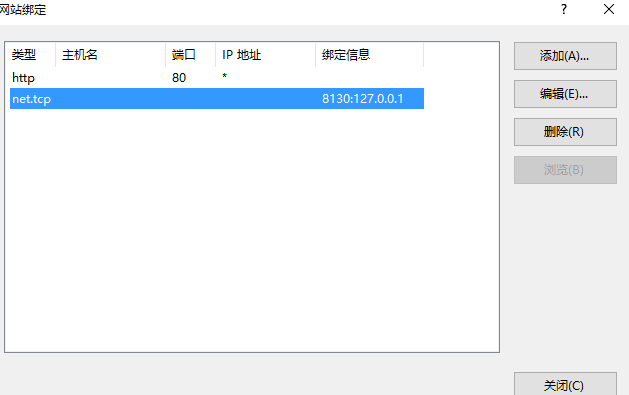
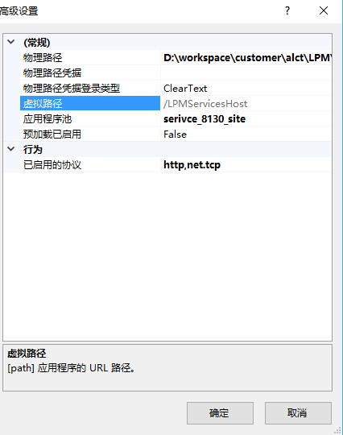

#1 安装IIS
"Control Panel" -> "启用或关闭Windows功能"

Dotnet Advandced Feature

#2 配置IIS

##2.1 Create Site

Control Panel-> 管理工具 -> "Internet Information Services (IIS)管理器"

#2.2 网站绑定要支持net.tcp

 
#2.3 应用需启用net.tcp支持

 

