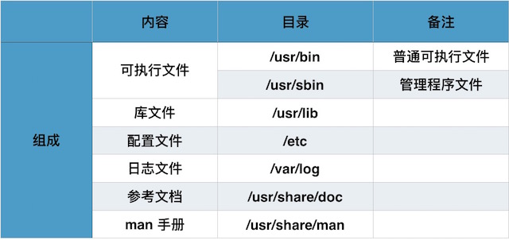

应用程序由那几部分组成的呢？我们通过下面这张表格来说明：


现在，让我们自己动手操作，查看一下 firefox 这个应用的组成。

在终端执行如下指令  “vagrant@vagrant-ubuntu-trusty-64:~$  dpkg -L firefox ” 。

会出现下面的显示信息：

````
.....
/etc                       //配置文件
/etc/firefox
/etc/firefox/syspref.js
.....
/usr/bin
/usr/lib                  //库文件
/usr/lib/firefox
.....
/usr/share/doc            //参考文档
/usr/share/doc/firefox
/usr/share/man            //man手册
/usr/share/man/man1
.....
/usr/bin/firefox          //可执行文件
.....
/usr/lib/firefox/dictionaries
/usr/share/pixmaps/firefox.png
````