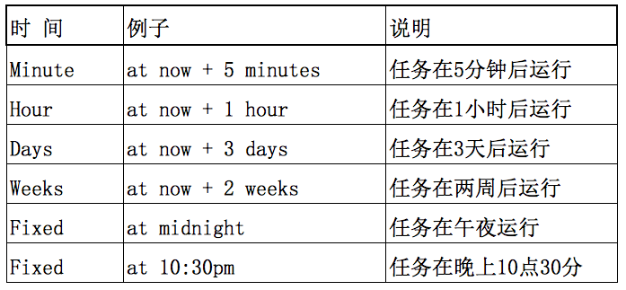

计划
在Linux下的两种计划(定时)执行任务的方法：at命令，以及cron服务。
# 1At
## 1.1简介
让特定任务运行一次，使用at命令:

* at命令，指定运行时间，就会在指定的时间运行一次任务
* at把任务放到/var/spool/cron/atjobs/目录中，到指定时间运行它 
* 查看任务使用atq命令
* 删除任务使用atrm命令

## 1.2 demo

例如：一个大型数据库，要在别人不用系统时去处理数据，比如凌晨1点30分。那么该先建立/home/liu/db_job.sh脚本管理数据库，计划处理/home/liu/db_job.sh文件中的结果。正常方式是这样启动下列命令:

````
vagrant@vagrant-ubuntu-trusty-64:~$ at 1:30 tomorrow
at>/home/liu/db_job.sh            //编写命令
at><EOT>                          //按Ctrl+D结束编辑
vagrant@vagrant-ubuntu-trusty-64:~$ atq                      //查看任务
1        Mon Jul 25 01:30:00 2016 a liu  //前面的数字“1”代表任务编号
vagrant@vagrant-ubuntu-trusty-64:~$ atrm 1                   //删除任务
vagrant@vagrant-ubuntu-trusty-64:~$ atq                      //查看任务
vagrant@vagrant-ubuntu-trusty-64:~$ 
````
AT Time中的时间表示方法示例：


# 1.3指定时间的方法

绝对计时法：

小时:分钟式：当天的hh:mm（小时:分钟），假如该时间已过去，那么就放在第二天执行。
模糊的词语：使用midnight（深夜），noon（中午），teatime（饮茶时间，一般是下午4点）等。
12小时计时制：在时间后面加上AM（上午）或PM（下午）来说明是上午还是下午。
具体日期：格式为month day（月 日）或mm/dd/yy（月/日/年）或dd.mm.yy（日.月.年）。指定的日期必须跟在指定时间的后面。 
相对计时法：

格式为：at now + count time-units ，now就是当前时间，time-units是时间单位，这里能够是minutes（分钟）、hours（小时）、days（天）、weeks（星期）。count是时间的数量，究竟是几天，还是几小时，等等。 更有一种计时方法就是直接使用today（今天）、tomorrow（明天）来指定完成命令的时间。
注意：一定要检查一下atd的服务是否启动，有些操作系统未必是默认启动的，linux默认为不启动，而ubuntu默认为启动的。检查是否启动，用service atd检查语法，用service atd status检查atd的状态，用service atd start启动atd服务。查看at执行的具体内容：一般位于/var/spool/cron/atjob目录下面， 用vi打开，在最后一部分就是你的执行程序。

# 2周期性任务
# 2.1简介

让特定任务周期性运行，使用Cron。Cron是一个linux下的定时执行工具，可以在无需人工干预的情况下运行作业。由于Cron 是Linux的内置服务，和atd一样需要确保它启动。
查看状态：service cron status

# 2.2 crontab命令

crontab -u  //设定某个用户的cron服务，一般root用户在执行这个命令的时候需要此参数  
crontab -l  //列出某个用户cron服务的详细内容
crontab -r  //删除没个用户的cron服务
crontab -e  //编辑某个用户的cron服务
比如说root查看自己的cron设置：crontab -u root -l ；再例如，root想删除liu的cron设置：crontab -u liu -r ；在编辑cron服务时，编辑的内容有一些格式和约定，输入：crontab -u root -e 。

# 2.3 cron文件语法

用crontab -e命令来编辑时候，必须要遵循语法：

分         //0-59
小时     //0-23
日        //1-31
月        //1-12
星期    //0-6
命令    //command
(取值范围，0表示周日一般一行对应一个任务)

记住几个特殊符号的含义:

“*”代表取值范围内的数字,
“/”代表”每”,
“-”代表从某个数字到某个数字,
“,”分开几个离散的数字

# 2.4 示例

例如：需要统计每分钟的服务器用户登陆记录，不使用Linux标准统计方法，使用自己编写脚本完成。
````
vagrant@vagrant-ubuntu-trusty-64:~$crontab -l                        //
no crontab for vagrant
vagrant@vagrant-ubuntu-trusty-64:~$crontab -u vagrant -e                 //
no crontab for vagrant - using an empty one

Select an editor.  To change later, run 'select-editor'.
  1. /bin/ed
  2. /bin/nano        <---- easiest
  3. /usr/bin/vim.tiny

Choose 1-3 [2]: 3                           //选择一个编辑工具
//用vi在文件尾部添加如下语句
*/1 *  *   *   *     who -all >> /home/vagrant/per_min.txt
//保存退出
crontab: installing new crontab             //添加完成
vagrant@vagrant-ubuntu-trusty-64:~$cat /home/liu/per_min.txt         //查看到每分钟用户的登陆信息
````
