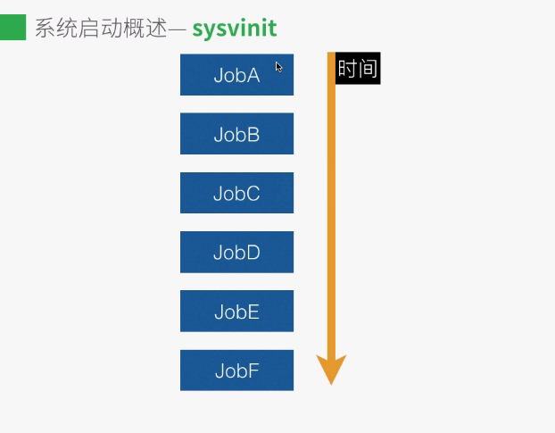

# 1启动流程


# 2不同的启动



# 3ubuntu14.04使用upstrart
配置文件在/etc/init，以.conf作为文件扩展名
upstart 负责系统的启动过程
如
````
# atd - deferred execution scheduler
#
# at is a standard UNIX program that runs user-specified programs at
# scheduled deferred times

description "deferred execution scheduler"

start on runlevel [2345]
stop on runlevel [!2345]

expect fork
respawn

exec atd
````


# 4upstrart 的initctl and service
service 命令是随着sysvinit发布的，upstrart提供了initctl,但是兼容service


# 5开机启动脚本
* /etc/bash.bashrc -所有用户生效
* ~/.bashrc  - 当前用户生效
