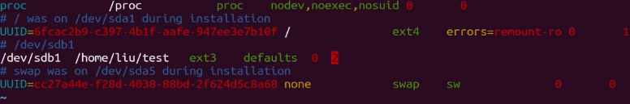

#1 文件的权限

在Linux文件系统的安全设计中，为文件设计了访问权限、所有者（归属）；访问权限分为：读、写、执行；所有者分为：属主（文件的拥有者帐号）、属组（文件的拥有组账户）。

````
vagrant@vagrant-ubuntu-trusty-64:~$ ls -al
total 56
drwxr-xr-x  6 vagrant vagrant 4096 Jun 19 15:30 .
drwxr-xr-x  4 root    root    4096 Jun 16 00:50 ..
-rw-------  1 vagrant vagrant  370 Jun 16 05:58 .bash_history
-rw-r--r--  1 vagrant vagrant  220 Apr  9  2014 .bash_logout
-rw-r--r--  1 vagrant vagrant 3661 Jun 16 00:58 .bashrc
drwx------  2 vagrant vagrant 4096 Jun 16 00:50 .cache
-rw-rw-r--  1 vagrant vagrant    0 Jun 19 13:02 new_
-rw-rw-r--  1 vagrant vagrant    0 Jun 19 13:02 new_file
-rw-rw-r--  1 vagrant vagrant 1212 Jun 19 15:31 per_min.txt
-rw-r--r--  1 vagrant vagrant  675 Apr  9  2014 .profile
-rw-rw-r--  1 vagrant vagrant   66 Jun 19 15:28 .selected_editor
-rw-r--r--  1 root    root    3197 Jun 16 00:52 sources.list.origin
drwx------  2 vagrant vagrant 4096 Jun 16 00:58 .ssh
drwxrwxr-x  3 vagrant vagrant 4096 Jun 19 14:08 tmp
drwxrwxr-x 16 vagrant vagrant 4096 Jun 16 06:00 velo-docker-composer
-rw-------  1 vagrant vagrant  783 Jun 19 10:42 .viminfo
````

第一个字段代表文件的类型和访问权限；

第1个字符：表示文件的类型，d(目录文件),b(块设备文件),c(字符设备文件),-(普通文件),l(链接文件)
第2～4个字符：表示该文件的属主对该文件的访问权限
第5～7个字符：表示该文件的属组对该文件的访问权限
第8～10个字符：表示其它任何用户对该文件的访问权限
第二个字段代表文件个数，如果是单个文件，数字为1；如果是目录，数字为目录下文件个数；

第三个字段代表文件的属主，文件拥有者账号；

第四个字段代表文件的属组，文件拥有组账号；

第五个字段代表文件的大小，用 byte 表示；

第六个字段代表文件的创建日期，用“月\日\时间”表示；

第七个字段代表文件的名称。

#2 设置文件的权限和归属

#2.1 chmod
计算规则：

所有文件类型的字符都表示 0；

* r 表示 4；
* w 表示 2；
* x 表示 1。

#2.2 chown

同时设置属主、属组，用冒号隔离。
````
sudo chown vagrant myjob.tmp
sudo chown :vagrant myjob.tmp 
sudo chown vagrant:vagrant myjob.tmp
````

#3 挂载和卸载文件系统

#3.1  挂载文件系统 mount

格式：mount ［-t 类型］ 存储设备  挂载点

#3.2  卸载文件系统
命令：umount

格式：umount   挂载点

#3.3 自动挂载文件系统

每次电脑启动后，可以自动识别硬盘，并且挂载到特定位置
````
vagrant@vagrant-ubuntu-trusty-64:~$ sudo vi /etc/fstab
vagrant@vagrant-ubuntu-trusty-64:~$ cat /etc/fstab
````


机器每次重新启动后文件就挂载成功。
