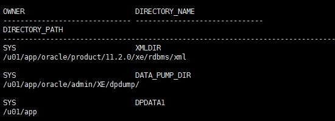

#1 问题
用oracle 命令impdp导入数据库，系统报错，步骤如下：
````
$ sqlplus system/manager
sql> create directory dpdata1 as '/u01/app';
sql> grant read, write on directory dpdata1 to abc;
````

$impdp abc/abc directory=dpdata1 dumpfile=abc.DMP job_name=Cases_Import
````
Connected to: Oracle Database 10g Enterprise Edition Release 10.2.0.3.0 - 64bit Production
With the Partitioning, OLAP and Data Mining options
ORA-39002: invalid operation
ORA-39070: Unable to open the log file.
ORA-29283: invalid file operation
ORA-06512: at "SYS.UTL_FILE", line 475
ORA-29283: invalid file operation
````

#2 分析
这里的“ORA-39070”提到的“Unable to open the log file.”初看非常的“诡异”，到底无法打开什么日志文件呢？难道是没有权限在这个目录下写文件？经过“touch”测试排除了这种可能性。
````
$sqlplus
sql> select * from dba_directories;
````


系统有一个DATA_PUMP_DIR,把文件copy到/u01/app/oracle/admin/XE/dpdump,重新执行
````
$impdp abc/abc directory=DATA_PUMP_DIR dumpfile=abc.DMP job_name=Cases_Import
````
工作。
impdp tms/tms directory=DATA_PUMP_DIR dumpfile=TMS-20170626.DMP job_name=Cases_Import

#3 导出数据
expdp abc/abc tables=CASES directory=DATA_PUMP_DIR dumpfile=abc-2017-06-27.dmp   job_name=CASES_EXPORT
