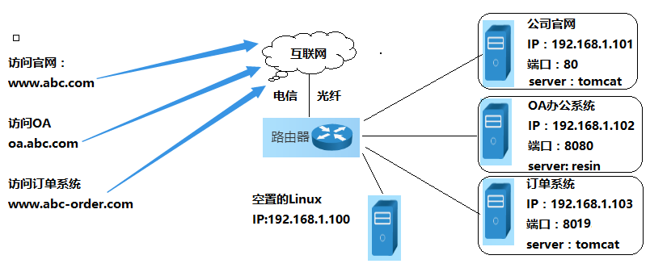
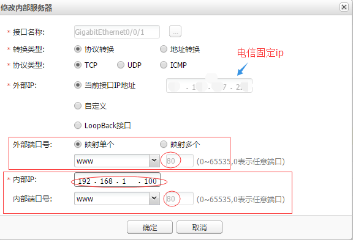

#1 Nginx Docker Custom Config
````
nginx:
    image: nginx
    volumes:
      - ./myserver.conf:/etc/nginx/conf.d/default.conf:ro 
    ports:
      - 80:80
````
Note: put customer configuration into /etc/nginx/conf.d/default.conf, all .conf in /etc/nginx/conf.d/ will be loaded 

#2 Configure Multiple Forward with one server name
````
server{
  listen 80;  
  server_name 61.152.132.245;
  access_log /var/log/nginx/wp.log;
  location /wp {       
       proxy_pass  http://61.152.132.245:2080;       
  }
  location /callback {
       proxy_pass  http://61.152.132.245:7070/wechat/portal;       
  }
  location /api {
       proxy_pass  http://61.152.132.245:8080;       
  }
}  

server{
  listen 443;  
  server_name 61.152.132.245;
  access_log /var/log/nginx/wp.log;
  location /wp {       
       proxy_pass  http://61.152.132.245:2443;       
  }
  
}  
````

Note: 
* Put multiple server into one file
* proxy_pass  http://61.152.132.245:7070/wechat/portal point to web application 
* Multiple location /wp, /api, /callback
* access_log /var/log/nginx/wp.log;

#3 使用Nginx实现同一固定IP上，多个Web站点访问不加端口号 

 一直以来在外网访问公司的内部系统都需要带端口号，原因是公司仅有一根带固定IP的宽带。现用路由器只能根据端口号（不能根据域名）转发到对应的Web系统，80端口只能分配给公司官网。经过研究发现在不增加宽带数量和费用的情况下，可以通过Nginx代理解决此问题。原理是在Nginx转发规则中配置不同的域名，让Nginx根据域名将请求转发到不同的内部服务器上。
 之前除官网外在访问OA和订单系统都要加端口号，访问过程：浏览器请求------>路由器------>服务器。

访问OA：www.oa.abc.com:8080
访问订单系统：www.abc-order.com:8019

        虚拟一个简单的公司内部网络如下图，配置过程参考step1~6。实现访问过程：浏览器请求------>路由器------>Nginx服务器------>路由器。



Step 1. 域名解析配置；将上图的所有域名解析到公司的固定IP上。
Step 2. Nginx安装；

找一台服务器安装Nginx，正好有一台空置的Linux 服务器（IP：192.168.1.100），就在上面安装的Nginx服务器；Nginx可以在windows和linux上安装，根据实际情况下载不同的版本
Step 3. Nginx服务测试，访问你的Nginx服务器地址
Step 4. 配置路由器转发；

使所有的80端口的请求都经路由器，转发到Nginx服务器（192.168.1.100）的80端口。访问固定IP，出现Step 3.中页面配置成功；

公司使用的是华为的路由器，如下图


Step 5. 配置Nginx域名转发规则；

 进入nginx安装目录，新建后缀名为*.conf的配置文件：abc.conf  、oa.conf 、order.conf。

````
文件：abc.conf

server {

        listen 80;

        server_name www.abc.com abc.com;

        #charset koi8-r;

        access_log /var/log/nginx/abc.access.log;

        location / {

            proxy_pass http://192.168.1.101:80;

            proxy_read_timeout 180s;

            break;

        }

}


文件：oa.conf

server {

        listen 80;

        server_name www.oa.abc.com oa.abc.com;

        #charset koi8-r;

        access_log /var/log/nginx/oa.access.log;

        location / {

            proxy_pass http://192.168.1.102:8080;

            proxy_read_timeout 180s;

            break;

        }

}

文件：order.conf

server {

        listen 80;

        server_name www.abc-order.com abc-order.com;

        #charset koi8-r;

        access_log /var/log/nginx/order.access.log;

        location / {

            proxy_pass http://192.168.1.103:8019;

            proxy_read_timeout 180s;

            break;

        }

}
````
