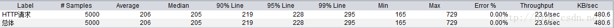

关于JMeter线程组中线程数，Ramp-Up Period，循环次数之间的设置概念

#1 测试参数

假设：
* 线程数： n
* Ramp-Up Period：T （有人称之为启动时间，有人说是准备时长，看个人喜好）
* 循环次数：a  
* 若每个循环运行时间是 t

推导：
* 当时间到 S = (T- T/n)时，最后一个线程启动
* 若要使所有线程同时运作，则需要在最后一个线程启动的时候第一个线程仍未关闭，为达到这个要求，需满足 a * t > S 
* 每个线程运行运行时间是  a * t
* 总的测试时间 (1 - 1/n) * T + a * t

#2 应用：
请求访问百度，得到聚会报告

* 线程数： n = 5
* Ramp-Up Period：T  = 10
* 循环次数：a  = 100 
* 若每个循环运行时间是 t = 0.2 

下图来直观的显示每个线程运行状况

从图中可以得到从第8秒开始，到第20秒，5个线程同时在运行中，此时才是真正的模拟5个用户同时并发说了这么多，我们的目的到底是什么？无非是如何设置线程数，Ramp-Up Period以及循环次数。

那么，如何检验ramp-up period I太小了或者太大了呢？首先，推测一下平均点击率并用总线程除点击率来计算初始的ramp-up period。 例如，假设线程数为100， 估计的点击率为每秒10次， 那么估计的理想ramp-up period 就是 100/10 = 10 秒。 那么，应怎样来提出一个合理的估算点击率呢？没有什么好办法，必须通过运行一次测试脚本来获得。

　　其次， 在测试计划（test plan）中增加一个聚合报告监听器，如图2所示，其中包含了所有独立的访问请求（一个samplers）的平均点击率。 第一次取样的点击率（如http请求）与ramp-up period 和线程数量密切相关。通过调整ramp-up period 可以使首次取样的点击率接近平均取样的点击率。
第三， 查验一下Jmeter日志(文件位置：JMeter_Home_Directory/bin) 的最后一个线程开始时第一个线程是否真正结束了，二者的时间差是否正常。

　　总之，是否能确定一个适当的ramp-up time 取决于以下两条规则: 
* 第一个取样器的点击率（hit rate）是否接近其他取样器的平均值，从而能否避免ramp-up period 过小。
* 在最后一个线程启动时，第一个线程是否在真正结束了，最好二者的时间要尽可能的长，以避免ramp-up period过大。

　　有时，这两条规则的结论会互相冲突。 这就意味着无法找到同时满足两条规则的合适的ramp-up period。 糟糕的测试计划通常会导致这些问题，这是因为在这样的测试计划里，取样器将不能充分地采集数据，可能因为测试计划执行时间太短并且线程会很快的运行结束。 