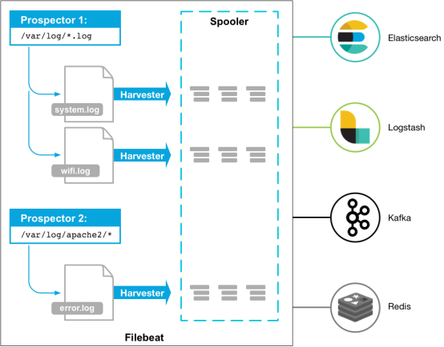

翻译自：https://www.elastic.co/guide/en/beats/filebeat/current/index.html

power by kerwin

# 1 概述

Filebeat是一个日志文件托运工具，在你的服务器上安装客户端后，filebeat会监控日志目录或者指定的日志文件，追踪读取这些文件（追踪文件的变化，不停的读），并且转发这些信息到elasticsearch或者logstarsh中存放。

以下是filebeat的工作流程：当你开启filebeat程序的时候，它会启动一个或多个探测器（prospectors）去检测你指定的日志目录或文件，对于探测器找出的每一个日志文件，filebeat启动收割进程（harvester），每一个收割进程读取一个日志文件的新内容，并发送这些新的日志数据到处理程序（spooler），处理程序会集合这些事件，最后filebeat会发送集合的数据到你指定的地点。

(个人理解，filebeat是一个轻量级的logstash，当你需要收集信息的机器配置或资源并不是特别多时，使用filebeat来收集日志。日常使用中，filebeat十分稳定，笔者没遇到过宕机。)

# 2 Filebeat入门
开始配置使用filebeat之前，你需要安装并配置好这些依赖程序：

Elasticsearch 作为存储和索引这些数据。

Kibana 作为展示平台。

Logstash（可选）去插入数据到elasticsearch

在安装完毕elastic集群之后，阅读接下来的选项学习怎样安装，配置，与运行filebeat。

## 2.1 安装filebeat
请选择你系统中的下载安装命令来下载安装filebeat。(deb for Debian/Ubuntu, rpm for Redhat/Centos/Fedora, mac for OS X, and win for Windows).

deb

curl -L -O https://artifacts.elastic.co/downloads/beats/filebeat/filebeat-5.1.1-amd64.deb

sudo dpkg -i filebeat-5.1.1-amd64.deb

## 2.2 配置filebeat

编辑配置文件来配置filebeat，对于rpm或者deb来说，配置文件是/etc/filebeat/filebeat.yml这个文件，对于MAC或者win来说，请查看你的解压文件中。

这里有一个简单的filebeat的配置文件filebeat.yml的样本，filebeat会使用很多默认的选项。

filebeat.prospectors:

- input_type: log

  paths:

    - /var/log/*.log

#- c:\programdata\elasticsearch\logs\*

 

让我们来配置filebeat：

1、定义你的日志文件的路径（一个或多个）

对于大多数的基本filebeat配置，你可以定义一个单一探测器针对一个单一的路径，例如：

 

filebeat.prospectors:

- input_type: log

  paths:

    - /var/log/*.log

 #json.keys_under_root: true 若收取日志格式为json的log，请开启此配置

 

在这个例子中，探测器会收集/var/log/*.log的所有匹配文件，这意味这filebeat会手机所有的/var/log下以.log结尾的文件，此处还支持Golang Glob支持的所有模式。

在预定义级别的子目录中获取所有文件，可以使用这个配置：/var/log/*/*.log，这会找到/var/log下所有子目录中所有的以.log结尾的文件。但它并不会找到/var/log文件夹下的以.log结尾的文件。现在它还不能递归的在所有子目录中获取所有的日志文件。

如果你设置输出到elasticsearch中，那么你需要在filebeat的配置文件中设置elasticsearch的IP地址与端口。

 

output.elasticsearch:

  hosts: ["192.168.1.42:9200"]

 

## 2.3 配置filebeat使用logstarsh

如果要使用logstash对filebeat收集起来的数据执行其他处理，你需要配置filebeat使用logstash。

你需要编辑filebeat的配置文件，注释elasticsearch的选项，并打开logstash的配置的注释：

 

#----------------------------- Logstash output --------------------------------

output.logstash:

  hosts: ["127.0.0.1:5044"]

 

hosts选项需要指明logstash服务所监听的地址和它的端口。

注：若要测试你的配置文件，切换到你安装好的filebeat的可执行文件的目录，然后在命令行运行以下选项：./filebeat -configtest -e ，确保您的配置文件在默认配置文件目录下，见 目录布局。

 

在使用这个配置之前，你需要提前设置好logstash来接收数据。

 

如果想不通过logstash直接入库到elasticsearch，可注释掉logstash入库部分，直接打开elasticsearch入库部分即可。

 

output.elasticsearch:

  hosts: ["localhost:9200"]

# 5 启动filebeat

sudo /etc/init.d/filebeat start

