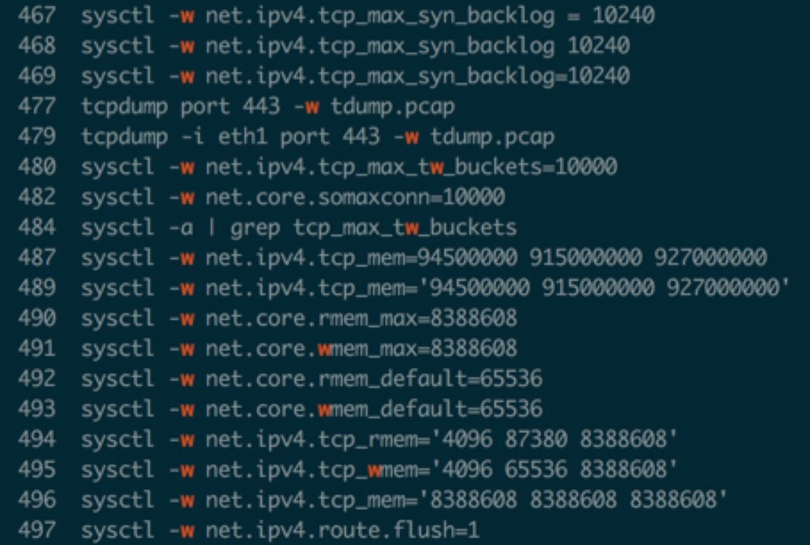

# 1. Sysctl Parameter
```
sudo sysctl -w net.ipv4.tcp_max_syn_backlog=10240

```
# 2. /etc/sysctl.conf文件

/etc/sysctl.conf是一个允许你改变正在运行中的Linux系统的接口。它包含一些TCP/IP堆栈和虚拟内存系统的高级选项，
可用来控制Linux网络配置，由于/proc/sys/net目录内容的临时性，建议把TCPIP参数的修改添加到/etc/sysctl.conf文件, 然后保存文件，
使用命令“/sbin/sysctl –p”使之立即生效。具体修改方案参照上文：

net.core.somaxconn

# 3. sysctl parameter

```
sudo sysctl -w net.ipv4.tcp_max_syn_backlog=10240
sudo sysctl -w net.ipv4.tcp_max_tw_buckets=10000
sudo sysctl -w net.core.somaxconn=10000
sudo sysctl -w net.ipv4.tcp_mem='94500000 915000000 927000000'
sudo sysctl -w net.core.rmem_max=8388608
sudo sysctl -w net.core.wmem_max=8388608
sudo sysctl -w net.core.rmem_default=65536
sudo sysctl -w net.core.wmem_default=65536
sudo sysctl -w net.ipv4.tcp_rmem='4096 87380 8388608'
sudo sysctl -w net.ipv4.tcp_wmem='4096 65536 8388608'
sudo sysctl -w net.ipv4.tcp_mem='8388608 8388608 8388608'
sudo sysctl -w net.ipv4.route.flush=1
```

