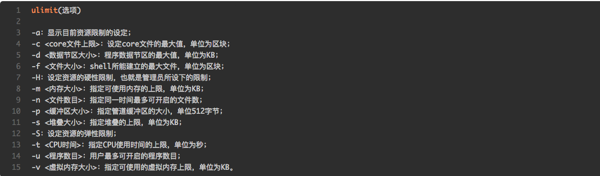

# 1 limit.conf

# 1.1 limits.conf工作原理
ulimit设置当前shell以及由它启动的进程的资源限制。

limits.conf是pam_limits.so的配置文件，然后/etc/pam.d/下的应用程序调用pam_***.so模块。譬如说，当用户访问服务器，服务程序将请求发送到PAM模块，PAM模块根据服务名称在/etc/pam.d目录下选择一个对应的服务文件，然后根据服务文件的内容选择具体的PAM模块进行处理。

# 1.2 /ect/security/limits.conf文件格式

```
username|@groupname   type  resource  limit 
```

* username|@groupname
设置需要被限制的用户名，组名前面加@和用户名区别。也可用通配符*来做所有用户的限制

* type
类型有soft，hard 和 -，其中 soft 指的是当前系统生效的设置值。hard 表明系统中所能设定的最大值。soft 的限制不能比 hard 限制高。用 - 就表明同时设置了 soft 和 hard 的值

* resource： 表示要限制的资源
nofile - 打开文件的最大数目
noproc - 进程的最大数目

## 1.3 ulimit 命令
ulimit命令用来限制系统用户对shell资源的访问

```
ulimit -a
```


 
# 2 sysctl.conf
≈
## 2.1 原理
/etc/sysctl.conf是一个允许你改变正在运行中的Linux系统的接口。它包含一些TCP/IP堆栈和虚拟内存系统的高级选项，
可用来控制Linux网络配置，由于/proc/sys/net目录内容的临时性，建议把TCPIP参数的修改添加到/etc/sysctl.conf文件, 然后保存文件，
使用命令“/sbin/sysctl –p”使之立即生效


## 2.2 sysctl命令

sysctl命令被用于在内核运行时动态地修改内核的运行参数，可用的内核参数在目录/proc/sys中。它包含一些TCP/IP堆栈和虚拟内存系统的高级选项， 这可以让有经验的管理员提高引人注目的系统性能。用sysctl可以读取设置超过五百个系统变量。

显示所有变量

```
sysctl -a 
sysctl -a | grep memory
```

显示变量的值 

```
sysctl -n kernel.hostname
```

设置变量
```
sysctl -w variable=value

```


## 2.3 常见参数 sysctl parameter

```
sudo sysctl -w net.ipv4.tcp_max_syn_backlog=10240
sudo sysctl -w net.ipv4.tcp_max_tw_buckets=10000
sudo sysctl -w net.core.somaxconn=10000
sudo sysctl -w net.ipv4.tcp_mem='94500000 915000000 927000000'
sudo sysctl -w net.core.rmem_max=8388608
sudo sysctl -w net.core.wmem_max=8388608
sudo sysctl -w net.core.rmem_default=65536
sudo sysctl -w net.core.wmem_default=65536
sudo sysctl -w net.ipv4.tcp_rmem='4096 87380 8388608'
sudo sysctl -w net.ipv4.tcp_wmem='4096 65536 8388608'
sudo sysctl -w net.ipv4.tcp_mem='8388608 8388608 8388608'
sudo sysctl -w net.ipv4.route.flush=1
sudo sysctl -w fs.file-max=34166
```