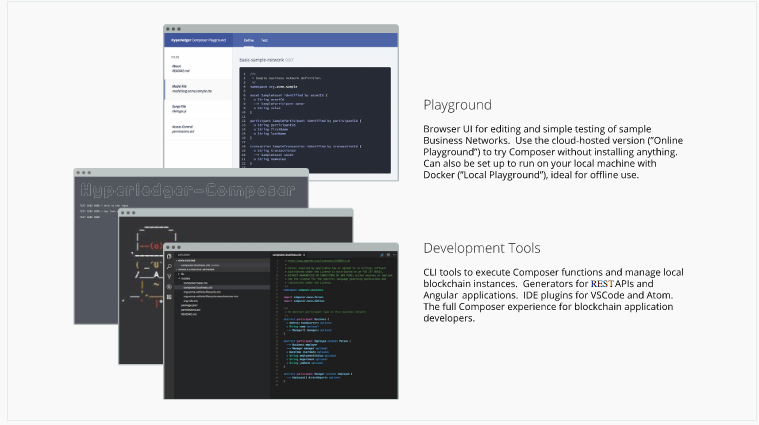

---
date: 2018-3-27 09:50:47+00:00
layout: post
title: 'Hyperledger Composer中的重要概念'
categories: 技术
tags:  Hyperledge 
---

Hyperledger Composer中的重要概念
Hyperledger Composer是一种包含建模语言和一组API的编程模型，用于快速定义和部署允许参与者发送交换资产的交易的业务网络和应用程序。

# Hyperledger Composer组件
您可以使用称为Hyperledger Composer Playground的基于浏览器的用户界面体验Hyperledger Composer。游乐场可作为托管版本（无需安装）或本地安装（适用于离线编辑和测试示例业务网络）。

想要使用Hyperledger Composer的完整应用程序开发功能的开发人员应安装开发人员工具。

# Hyperledger Composer组件图

# Hyperledger Composer中的重要概念

## 区块链状态存储
通过商业网络提交的所有交易都存储在区块链分类帐中，资产和参与者的当前状态存储在区块链状态数据库中。区块链通过一组对等点分配账本和状态数据库，并确保对使用一致算法的所有对等点的分类账和状态数据库的更新保持一致。

## 连接配置文件
Hyperledger Composer使用连接配置文件连接到运行时。连接配置文件是位于用户主目录（或可能来自环境变量）中的JSON文档，在使用Composer API或命令行工具时通过名称引用。使用连接配置文件可确保代码和脚本轻松地从一个运行时实例移植到另一个实例。您可以在参考部分阅读关于连接配置文件的更多信息。

## 资产
资产是有形或无形的商品，服务或财产，并存储在注册管理机构中。资产几乎可以代表商业网络中的任何东西，例如，待售房屋，销售清单，该房屋的土地登记证书以及该房屋的保险文件可能都是一个或多个商业网络中的资产。

资产必须具有唯一标识符，但除此之外，它们可以包含您定义的任何属性。资产可能与其他资产或参与者有关。

## 参与者
参与者是商业网络的成员。他们可能拥有资产并提交交易。参与者类型是建模的，并且像资产一样，必须具有标识符并且可以根据需要具有任何其他属性。

## 身份证和身份证
在商业网络中，参与者可以与身份相关联。身份证是身份，连接配置文件和元数据的组合。身份证简化了连接到商业网络的过程，并将商业网络外的身份概念扩展到身份的“钱包”，每个身份都与特定的业务网络和连接配置文件相关联。

## 交易
交易是参与者与资产交互的机制。这可以像参与者对拍卖中的资产投标或拍卖人标记拍卖关闭一样简单，自动将资产所有权转移给出价最高的投标人。

## 查询
查询用于返回有关区块链世界状态的数据。查询在业务网络中定义，并且可以包含用于简单定制的可变参数。通过使用查询，可以轻松地从您的区块链网络中提取数据。查询通过使用Hyperledger Composer API发送。

## 活动
业务网络定义中的事件与资产或参与者相同。一旦事件已被定义，它们可以由事务处理器功能发出，以向外部系统指示分类账发生了重要的事情。应用程序可以通过composer-client API订阅发出的事件。

## 访问控制
业务网络可能包含一组访问控制规则。访问控制规则允许对参与者访问业务网络中的哪些资产以及在什么条件下进行细粒度控制。访问控制语言足够丰富，可以通过声明捕捉复杂的条件，例如“只有车主才能转让车辆所有权”。事务处理器功能逻辑的外部访问控制使检查，调试，开发和维护变得更加容易。

## 历史记录注册表
历史学家是一个专门的登记处，记录成功的交易，包括提交他们的参与者和身份。历史记录将事务存储为HistorianRecord资产，这些资产在Hyperledger Composer系统名称空间中定义。