# 1. Create SSIS Catelog

选择　Integration Services Catelogs, like diagram below

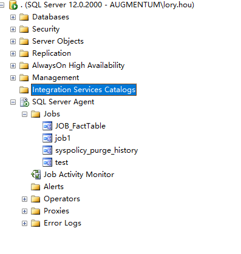

Right Click, and Select "Create Catelog" 

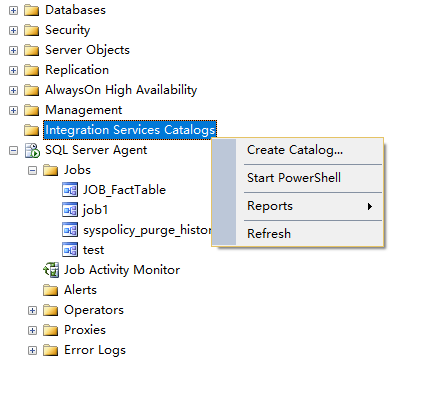

Input password as following:

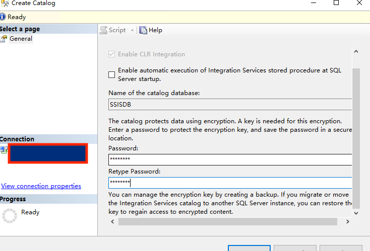

Click OK button to complete Creating SSIS Categlog

# 2. Create Folder

Select new catelog created, right click, and select "Create Folder" 

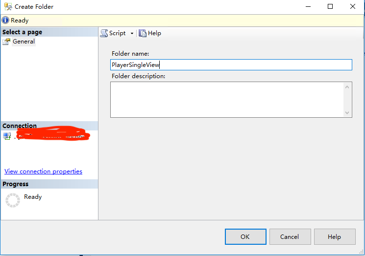

# 3 Deploy Project

Select the new created folder and projects, right click, then click "Deploy Project"

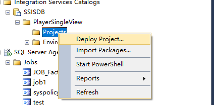

Select Project Deployment file, like below:

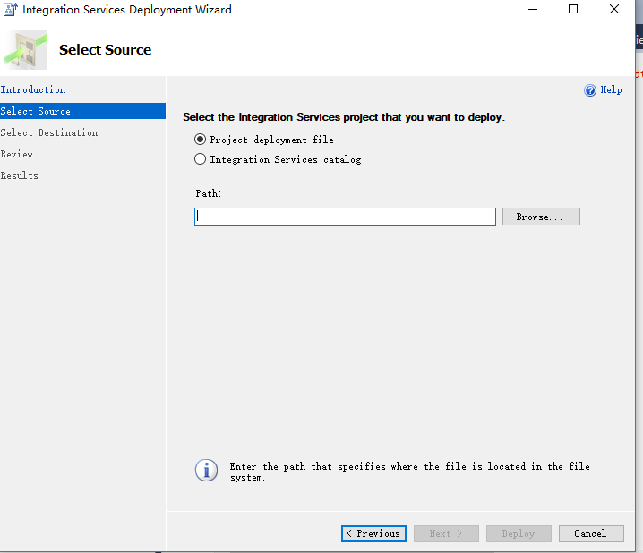

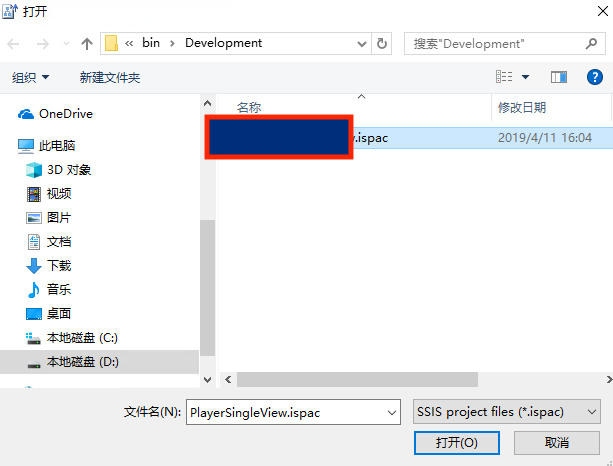

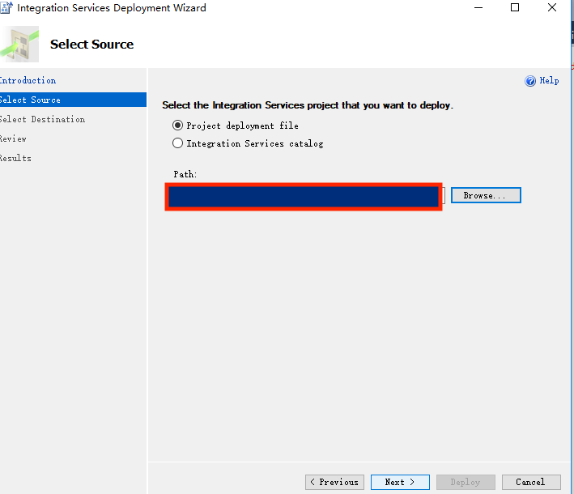

Click Next to continue deployment

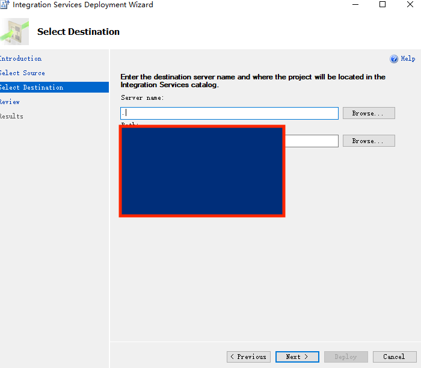

Select Destination

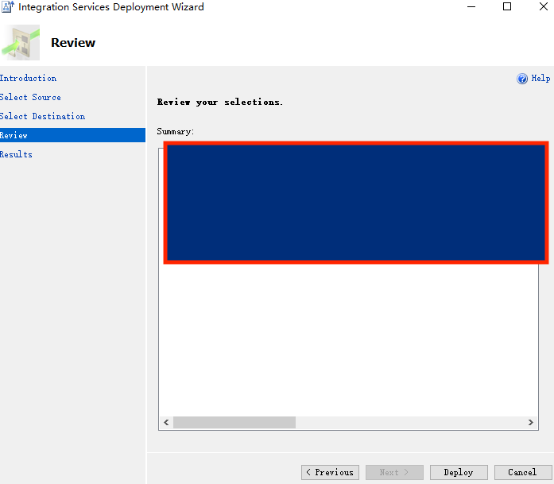

Click Deploy

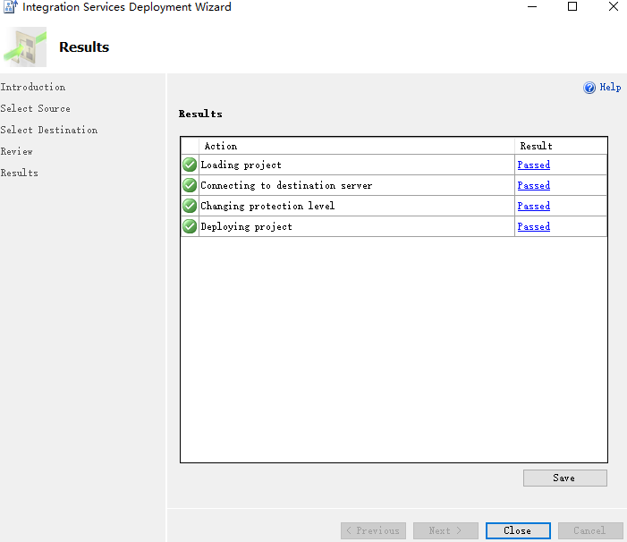

Click Close button to complete deployment

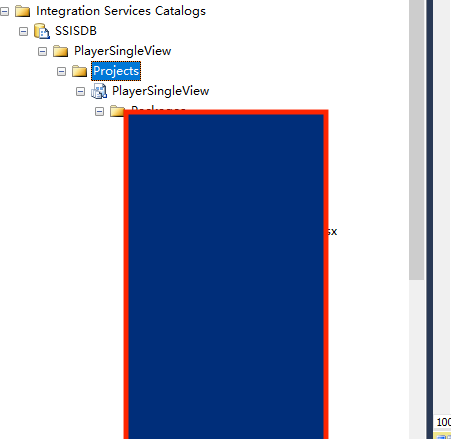

Check Deploy
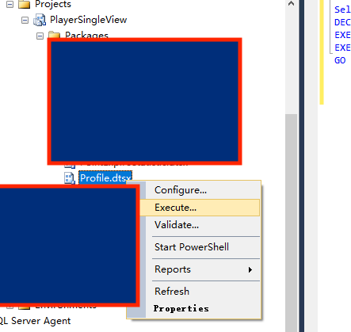

# 4 Create script 
Select a package, and click execute, then select script 
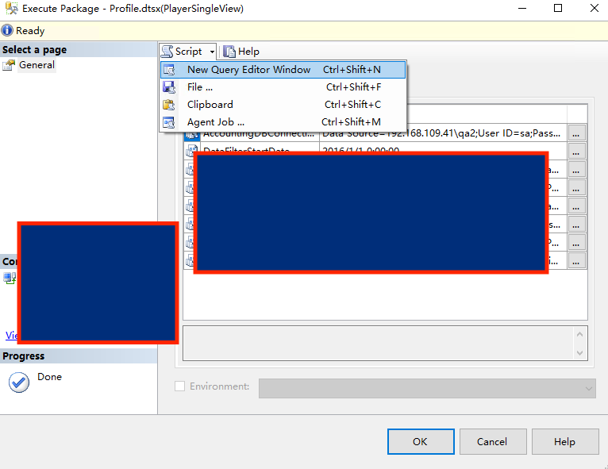

# 5 Create scheduler 

Type T-SQL, and database is SSISDB
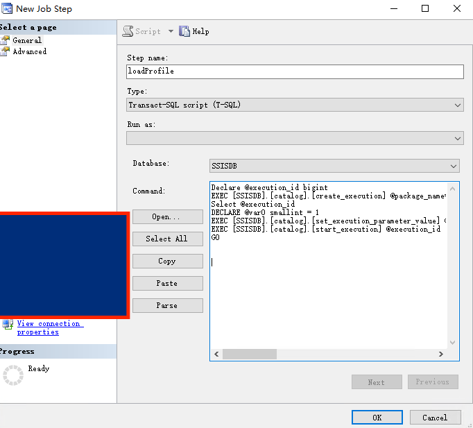
