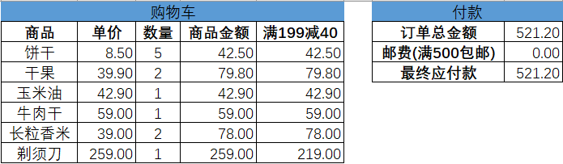
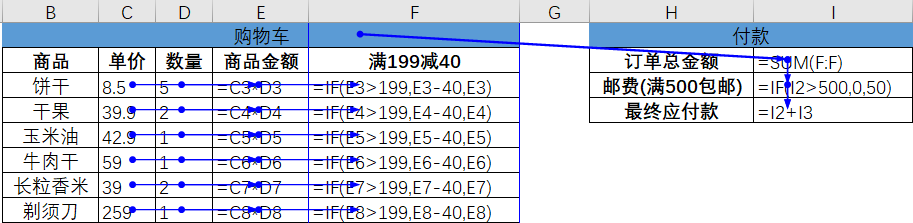
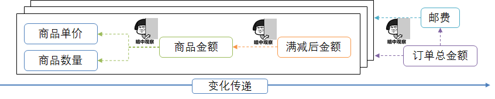
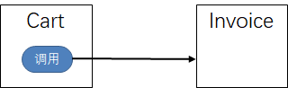
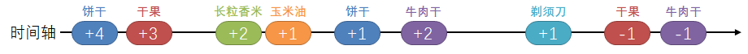

#  什么是响应式编程？
在开始讨论响应式编程（Reactive Programming）之前，先来看一个我们经常使用的一款堪称“响应式典范”的强大的生产力工具——电子表格。

举个简单的例子，某电商网站正在搞促销活动，任何单品都可以参加“满199减40”的活动，而且“满500包邮”。吃货小明有选择障碍（当然主要原因还是一个字：穷），他有个习惯，就是先在Excel上根据预算算好自己要买的东西：


相信大家都用过Excel中的公式，这是一个统计购物车商品和订单应付金额的表格，其中涉及到一些公式：



上图中蓝色的线是公式的引用关系，从中可以看出，“商品金额”是通过“单价x数量”得到的，“满199减40”会判断该商品金额是否满199并根据情况减掉40，右侧“订单总金额”是“满199减40”这一列的和，“邮费”会根据订单总金额计算，“最终应付款”就是订单总金额加上邮费。

##  变化传递（propagation of change）
为什么说电子表格软件是“响应式典范”呢，因为“单价”和“数量”的任何变动，都会被引用（“监听”）它的单元格实时更新计算结果，如果还有图表或数据透视图引用了这块数据，那么也会相应变化，做到了实时响应。变化的时候甚至还有动画效果，用户体验一级棒！

这是响应式的核心特点之一：变化传递（propagation of change）。一个单元格变化之后，会像多米诺骨牌一样，导致直接和间接引用它的其他单元格均发生相应变化。



看到这里，你可能会说，“切~ 不就是算付款金额吗，购物网站上都有这个最基础不过的功能啊~”，这就“响应式”啦？但凡一个与用户交互的系统都得“响应”用户交互啊~

但是在响应式编程中，基于“变化传递”的特点，触发响应的主体发生了变化。假设购物车管理和订单付款是两个不同的模块，或者至少是两个不同的类——Cart和Invoice。也许我们的代码是这样的：

Product.java（假设商品有两个属性name和price，简单起见，price就不用BigDecimal类型了）

```
public class Product {
    private String name;
    private double price;
    // 构造方法、getters、setters
}
```
Cart模块中：

```
import com.example.Invoice; // 2

public class Cart {
    ...
    public boolean addProduct(Product product, int quantity) {
        ...
        double figure = product.getPrice() * quantity;
        invoice.update(figure); // 1
        ...
    }
    ...
}
```
是由Cart的对象去调用Invoice对象的更新订单金额的方法；
Cart的代码中需要import Invoice。


而我们再观察这个Excel，发现“订单总金额”的计算公式不仅位于自己的单元格中，而且这个公式能主动监听和响应购物车数据的变化事件。对于购物车来说，它没有对订单付款方面的任何公式引用。感觉就像这样：

假设数据流有操作的商品product和变化个数quantity两个属性：

```
public class CartEvent {
    private Product product;
    private int quantity;
    // 构造方法、getters、setters
}
```
Invoice模块中：

```
import com.example.Cart // 2

public class Invoice {
    ...
    public Invoice(Cart cart) {
        ...
        this.listenOn(cart);    // 1
        ...
    }
    // 回调方法
    public void onCartChange(CartEvent event) {
        ...
    }
    ...
}
```

1. 是由Invoice的对象在初始化的时候就声明了对Cart对象的监听，从而一旦Cart对象有响应的事件（比如添加商品）发生的时候，Invoice就会响应；
2. Invoice的代码中import Cart。


做过Java桌面开发的朋友可能会想到Java swing中的各种监听器，比如MouseListener能够监听鼠标的操作，并实时做出响应。所以C/S的客户端总是比B/S的Web界面更具有响应性嘛。

所以，这里我们说的是一种生产者只负责生成并发出数据/事件，消费者来监听并负责定义如何处理数据/事件的变化传递方式。

那么，Cart对象如何在发生变化的时候“发出”数据或事件呢？

## 数据流（data stream）
这些数据/事件在响应式编程里会以数据流的形式发出。

我们再观察一下购物车，这里有若干商品，小明每次往购物车里添加或移除一种商品，或调整商品的购买数量，这种事件都会像过电一样流过这由公式串起来的多米诺骨牌一次。这一次一次的操作事件连起来就是一串数据流（data stream），如果我们能够及时对数据流的每一个事件做出响应，会有效提高系统的响应水平。这是响应式的另一个核心特点：基于数据流（data stream）。

如下图是小明选购商品的过程，为了既不超预算，又能省邮费，有时加有时减：



这一次一次的操作就构成了一串数据流。Invoice模块中的代码可能是这样：
```
    public Invoice(Cart cart) {
        ...
        this.listenOn(cart.eventStream());  
        ...
    }
```


其中，cart.eventStream()是要监听的购物车的操作事件数据流，listenOn方法能够对数据流中到来的元素依次进行处理。


## 声明式（declarative）
我们再到listenOn方法去看一下：

Invoice模块中，上边的一串公式被组装成如下的伪代码：

```
public void listenOn(DataStream<CartEvent> cartEventStream) {   // 1
        double sum = 0；
        double total = cartEventStream
            // 分别计算商品金额
            .map(cartEvent -> cartEvent.getProduct().getPrice() * cartEvent.getQuantity())  // 2
            // 计算满减后的商品金额
            .map(v -> (v > 199) ? (v - 40) : v)
            // 将金额的变化累加到sum
            .map(v -> {sum += v; return sum;})
            // 根据sum判断是否免邮，得到最终总付款金额
            .map(sum -> (sum > 500) ? sum : (sum + 50));
        ...
```

cartEventStream是数据流，DataStream是某种数据流类型，可以暂时想象成类似在Java 8版本增加的对数据流进行处理的Stream API（下节会说到为啥不用Java Stream）。

map方法用于对数据流中的元素进行映射，比如第一个将cartEvent中的商品价格和数量拿到，然后算出本次操作的金额；第二个判断是否能享受“满199减40”的活动。

这是一种“声明式（declarative）”的编程范式。通过四个串起来的map调用，我们先声明好了对于数据流“将会”进行什么样的处理，当有数据流过来时，就会按照声明好的处理流程逐个进行处理。

比如对于第一个map操作：


声明式编程范式的威力在于以不变应万变。无论到来的元素是什么，计算逻辑是不变的，从而形成了一种对计算逻辑的“绑定”。

总结来说，命令式是面向过程的，声明式是面向结构的。

不过命令式和声明式本身并无高低之分，只是声明式比较适合基于流的处理方式。这是响应式的第三个核心特点：声明式（declarative）。结合“变化传递”的特点，声明式能够让基于数据流的开发更加友好。

# 总结

总结起来，响应式编程（reactive programming）是一种基于数据流（data stream）和变化传递（propagation of change）的声明式（declarative）的编程范式。

响应式编程的“变化传递”就相当于果汁流水线的管道；在入口放进橙子，出来的就是橙汁；放西瓜，出来的就是西瓜汁，橙子和西瓜、以及机器中的果肉果汁以及残渣等，都是流动的“数据流”；管道的图纸是用“声明式”的语言表示的。

这种编程范式如何让Web应用更加“reactive”呢？

我们设想这样一种场景，我们从底层数据库驱动，经过持久层、服务层、MVC层中的model，到用户的前端界面的元素，全部都采用声明式的编程范式，从而搭建一条能够传递变化的管道，这样我们只要更新一下数据库中的数据，用户的界面上就相应的发生变化，岂不美哉？尤其重要的是，一处发生变化，我们不需要各种命令式的调用来传递这种变化，而是由搭建好的“流水线”自动传递。

这种场景用在哪呢？比如一个日志监控系统，我们的前端页面将不再需要通过“命令式”的轮询的方式不断向服务器请求数据然后进行更新，而是在建立好通道之后，数据流从系统源源不断流向页面，从而展现实时的指标变化曲线；再比如一个社交平台，朋友的动态、点赞和留言不是手动刷出来的，而是当后台数据变化的时候自动体现到界面上的。

