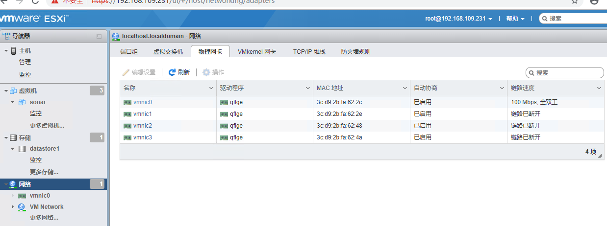

# Enable ssh

Login into ESXi Web UI -> Host -> Manage -> Services -> TSM-SSH -> Start to start SSH service.

## List software installed

```
esxcli software vib list
```

# Esxi disk slow

## How to find disk slow

Host -> Monitor -> Disk

写入速率和最长延迟


## Upgrae disk driver
For hp, install nhpsa disk driver

```
esxcli software vib install -v /tmp/xyz.vib
```

## Change configuration
For Hp, install ssacli 

```
esxcli software vib install -v /tmp/ssacli-3.25.4.0-6.5.0.vib
```

# Esxi network slow

network\vmnic0 
100 Mbps; 全双工

