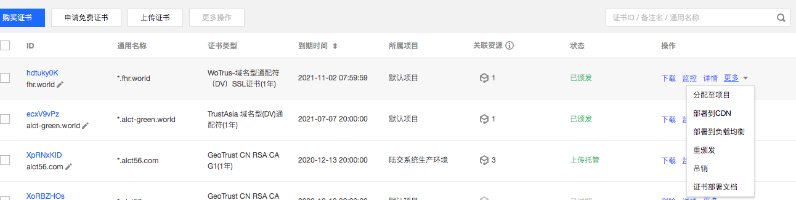
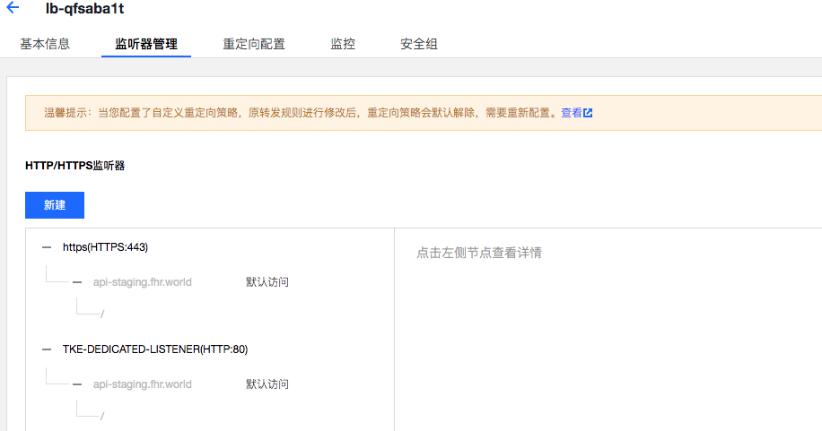
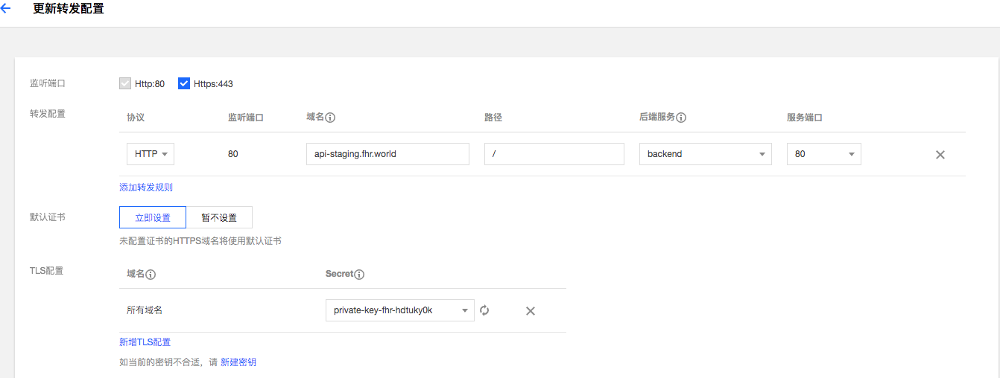

系统部署

# 1 购买域名

# 2 购买ssl证书
ssl 证书需要 DNS

# 3 域名备案

不备案，https访问不支持

# 4 创建私有网络

规划网路：
 * app子网 
 * db子网

# 5 创建K8s 集群及电脑

# 6 创建Kubectl Client Image 

# 7 开发运维脚本

# 8 购买redis和RDS

初始化数据库，初始化数据库脚本，备份数据库脚本

# 9 修改部署脚本

支持云上的环境信息

# 10 创建Ingress

# 11 配置SSL 证书到LB

# 12 LB 配置Https 

# 12 Ingress 创建密钥匙
集群 ->集群Id ->服务与路由 -> Ingress -> 更新转发配置 ->新建密钥

